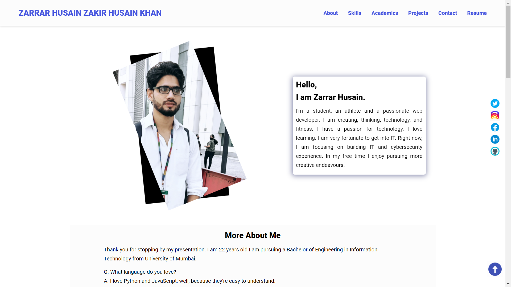

# [ZARRAR HUSAIN KHAN](https://zarry7i.github.io/)

## Table of Contents
* [Author](author)
* [GitHub Repo](#github-repo)
* [Technologies Used](#technologies-used)
* [Folder Strucure](#folder-structure)

## Author

[@zarry7i](https://www.twitter.com/zarry7i)

## Github repo

This is the [link](https://github.com/zarry7i/myPortfolio) to the Github repo of the project

## Technologies Used

HTML, CSS, Vanilla JavaSCript

## Folder Structure

The index.html and readme files are in the root folder, alongside the screenshot included in the readme.

The assets folder contains the CSS and JavaScript files, all images and icons used, in their respective folders.
